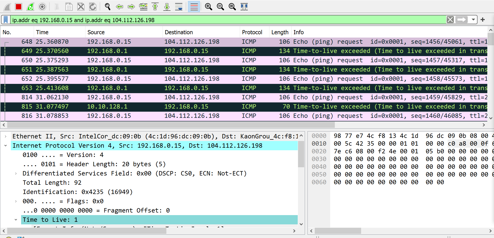
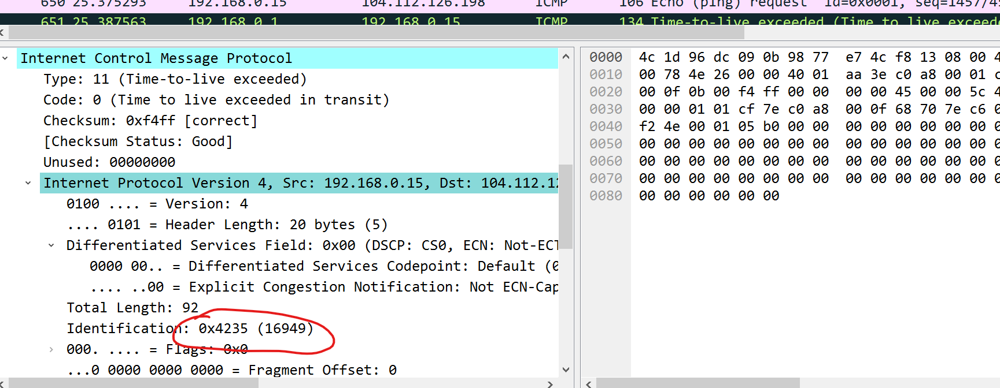
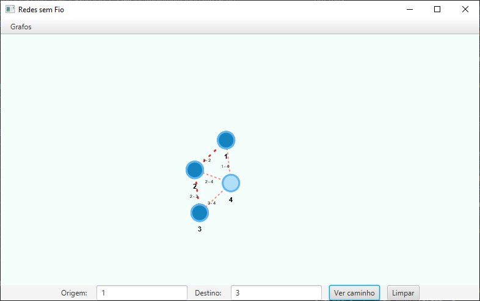
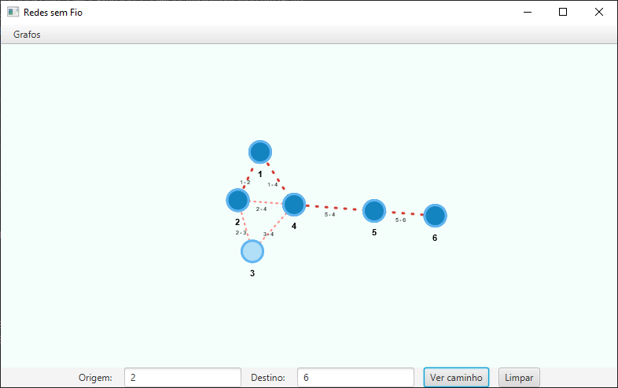

# Exercicio 1

_Victor Emanuel Perticarrari Osório_

## Usando `tracert`

### Executando no bash.

Vemos que o programa identifica todos pontos usado na rota das mensagens.

```bash
$ tracert www.mit.edu

Tracing route to e9566.dscb.akamaiedge.net [2600:1419:6a00:193::255e]
over a maximum of 30 hops:

  1    14 ms     4 ms     8 ms  2804:14c:483:408e:9a77:e7ff:fe4c:f813
  2     *        *        *     Request timed out.
  3   225 ms   174 ms    79 ms  2804:14c:400:a8::1
  4   148 ms    85 ms    28 ms  2804:a8:2:c0::e6
  5     *        *       14 ms  2804:a8:2:c0::15bd
  6     *        *        *     Request timed out.
  7     *        *        *     Request timed out.
  8     *        *        *     Request timed out.
  9    29 ms    19 ms    20 ms  2804:a8:2:b8::6862
 10    20 ms    17 ms    15 ms  ae5.r02.border.gru03.sdn.netarch.akamai.com [2600:1488:c000::19]
 11    28 ms    28 ms    20 ms  vlan102.r04.spine.gru03.sdn.netarch.akamai.com [2600:1419:6e00:305::1]
 12    42 ms    36 ms    34 ms  vlan104.r03.tor.gru03.sdn.netarch.akamai.com [2600:1419:6e00:703::1]
 13    38 ms    26 ms    19 ms  g2600-1419-6a00-0193-0000-0000-0000-255e.deploy.static.akamaitechnologies.com [2600:1419:6a00:193::255e]

Trace complete.
```

```bash
$ tracert -4 www.mit.edu

Tracing route to e9566.dscb.akamaiedge.net [23.216.194.57]
over a maximum of 30 hops:

  1     7 ms     5 ms     9 ms  192.168.0.1
  2    15 ms    12 ms    21 ms  10.10.128.1
  3    19 ms    24 ms    16 ms  c9521a1d.virtua.com.br [201.82.26.29]
  4    17 ms    15 ms    15 ms  c9521fa8.virtua.com.br [201.82.31.168]
  5    28 ms    22 ms    37 ms  embratel-T0-4-0-0-4004-uacc01.cas.embratel.net.br [200.213.139.1]
  6    32 ms    22 ms    18 ms  ebt-B112-agg04.spomb.embratel.net.br [200.230.243.86]
  7    17 ms    17 ms    17 ms  peer-B81-agg04.spomb.embratel.net.br [189.23.129.74]
  8   117 ms    59 ms    43 ms  ae6.r02.border.gru01.sdn.netarch.akamai.com [23.203.159.19]
  9    18 ms    17 ms    30 ms  192.168.224.129
 10    20 ms    17 ms    21 ms  192.168.225.139
 11    17 ms    20 ms    15 ms  a23-216-194-57.deploy.static.akamaitechnologies.com [23.216.194.57]

Trace complete.
```

### Verificando no Wireshark

Pelo Wireshark foi possível identificar o algoritmo usado pelo `tracert` para descobrir a rota. Ele envia 3 mensagens ICMPs com TTLs incremental e coleta as respostas. Os vários nós da rede responderão com _Time-to-live exceeded_ revelando o seu endereço de IP. 



O tempo de resposta pode ser calculado usando a própria mensagem envida, já que o Router coloca a mensagem original dentro da mensagem ICMP e cada pacote IP tem um identificador.



Como o IP é um protocolo da camada de Network e o TTL é parte do pacote IP, serão identificado Routers e não Switches.

## Implementando um Grafo

Exercício feito em Java.

Para implementar esse exercício procurei uma biblioteca gráfica para exibição de grafos. A [brunomnsilva/JavaFXSmartGraph](https://github.com/brunomnsilva/JavaFXSmartGraph) era apenas para visualização, por isso fiz um fork e adicionei as seguintes funcionalidades: 

* Descoberta de caminhos usando Dijkstra
* Exibição de caminhos

Na implementação do Dijkstra foi feito uma identificação de ciclos e foi adicionado como condição de parada a não adição de caminhos maiores que o menor caminho já encontrado. Isso foi feito porque o _loop_ leva em consideração os passos e não o peso de cada aresta.

```java
default Path<V, E> dijkstra(Vertex<V, E> source, Vertex<V, E> destiny) {
    if (!this.hasVertex(source) || !this.hasVertex(destiny)) {
        throw new InvalidVertexException("Vertex does not exists!");
    }

    Path<V, E> shortestPath = null;
    var queue = new LinkedList<Path<V, E>>();
    queue.add(new Path<>(source));

    while (!queue.isEmpty()) {
        var path = queue.removeFirst();
        if (path.endsWith(destiny)) {
            if (shortestPath == null || shortestPath.distance() > path.distance()) {
                shortestPath = path;
            }
        } else if (shortestPath == null || shortestPath.distance() <= path.distance()) {
            path.accessibleVertices()
                .filter(v -> !path.contains(v))
                .map(v -> path.walk(v.graph().edge(path.tail(), v).get()))
                .forEach(queue::add);
        }
    }
    return shortestPath;
}
```

Essa é a exibição da rede proposta:



Essa foi uma rede criada para validar o uso dos pesos de enlace. 

```
1 2 0.5
1 4 0.5
2 3 1
2 4 5
3 4 1
5 4 1
5 6 1
```

Observe como o caminho escolhido passa por 2 e 4 para evitar a aresta com peso 5.

