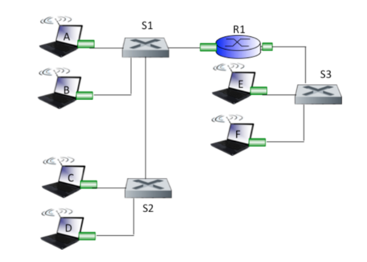

# Teste de Conhecimentos: Redes de Computadores

Nome: _victor Emanuel Perticarrari Osório_
## 1. Qual a diferença entre hub, switch e roteador?

**Switches** geralmente são utilizados em redes locais, enquanto **roteadores** são utilizados 
principalmente nas partes mais internas da rede. 

**Hubs** são dipositivos simples que atuam na camada física (1). Um hub replica o sinal que 
recebe de um lado em várias pontas podendo ser usado para conectar uma interface em diversas
interfaces criando uma topologia estrela baseada em hub, ou lan de difusão. (_Página 390_)

**Switches** atuam na camada de enlace (2) lendo quadros de uma interface e repassando para as 
demais interfaces. Ao contrário do hub, o switch é capaz de ler e interpretar os dados recebidos,
tendo a função de filtrar ou repassar os quadros baseado em uma tabela de comutação. (_Página 394_)

**Roteadores** tem uma função parecida com os switches mas atuam na camada de rede (3). Enquanto
switches usando o endereço MAC para fazer o roteamento, os roteadores usarão o endereço IP. (_Página 397_)

## 2. Descreva a tecnologia Ethernet (objetivos, método de acesso ao meio, padrões entre outros).

Ethernet é uma LAN de transmissão por difusão - todos os quadros transmitidos movem-se para, e são 
processados por, todos os adaptadores conectados ao barramento. (_Página 389_)

A Ethernet não é uma única tecnologia, mas uma familia de tecnologias que vem evoluindo desde  os anos 
1970, Sendo padronizada pelo grupo de trabalho IEEE 802.3 CSMA/CD (Ethernet) (IEEE 802.3, 2020), onde CSMA/CD 
é Acesso múltiplo com detecção de portadora com detecção de colisão.

## 3. Qual é a diferença entre controle de fluxo e controle de congestionamento do TCP? Explique os dois métodos em detalhes.

O controle de fluxo é responsável pela gerenciamento do buffer de leitura disponível. Existirá duas velocidades de 
leituras distintas em uma aplicação. A velocidade em que dados são adicionados ao buffer e a velocidade que dados são
lidos pela aplicação do buffer, o controle de fluxo é responsável por compatibilizar essas velocidades de forma
que o buffer nunca seja exaurido.

O control de congestionamento é feito pelo TCP para se evitar congestionamento da rede. Se um remetente percebe
o congestionamento ele pode diminuir a taxa de envio, ao passo que se o rementete percebe que não há congestionamento
pode aumentar a taxa de envio. (_Página 208_)

## 4. Considerar o endereço IP 200.134.9.2/20 de uma sub-rede com máscara de acordo com a notação CIDR. Apresentar a faixa total de endereços atribuída a essa sub­rede, incluindo: endereço de rede, primeiro endereço de máquina, último endereço de máquina e o endereço de broadcast.

## 5. Dê um exemplo completo do funcionamento do NAT mostrando o que muda nos pacotes de saída e entrada da rede local, tabela NAT, etc.

TODO

## 6. Considere a Figura abaixo. Suponha que as máquinas sejam nomeadas da seguinte forma:

```
Máquina A: IP 111.111.111.111
Máquina B: IP 111.111.111.112
Máquina C: IP 222.222.222.221
Máquina D: IP 222.222.222.222
Roteador : R1
Comutador entre A e B: C1
Comutador entre C e D: C2
```



### a. Considere o envio de um datagrama IP do Hospedeiro A ao Hospedeiro B. O Hospedeiro A pedirá ajuda ao roteador R1 para enviar o datagrama? Por quê? No quadro Ethernet que contém o datagrama IP, qual são os endereços de origem e destino IP e MAC?

TODO

### b. Suponha que B gostaria de enviar um datagrama IP a C, e que o cache ARP de B não tenha o endereço MAC de C. Então B preparará uma consulta ARP para descobrir o endereço MAC de C? Por quê? No quadro Ethernet (que contém o datagrama IP destinado a C) que é entregue ao roteador R1, quais são os endereços de origem e destino IP e MAC?

TODO

### c. Suponha que o Hospedeiro A gostaria de enviar um datagrama IP ao Hospedeiro B, e nem o cache ARP de A contém o endereço MAC de B, nem o ARP cache de B contém o endereço MAC de A. Suponha também que a tabela de encaminhamento do comutador C1 contenha entradas somente para o Hospedeiro B e para o roteador R1. Dessa forma, A transmitirá uma mensagem de requisição ARP. Que ações o comutador C1 tomará quando receber a mensagem de requisição ARP? O roteador R1 também receberá a mensagem de requisição ARP? Se sim, R1 encaminhará a mensagem para a outra sub­rede? Assim que o Hospedeiro B receber essa mensagem de requisição ARP, ele enviará a mensagem de volta ao Hospedeiro A. Mas enviará uma mensagem ARP de consulta para o endereço MAC de A? Por quê? O que o comutador C1 fará quando receber mensagem de resposta ARP do Hospedeiro B? 

TODO

## 7. Considere um aluno que deseja se conectar a rede da universidade para acessar um site. Em primeiro lugar ele precisa se conectar a essa rede (receber um endereço IP). Como é a primeira vez, sua tabela ARP está vazia. Ele quer acessar o site da Google. Além disso, o endereço IP do servidor (destino) também é desconhecido. Nesse cenário, liste todos os protocolos (camada de enlace, rede, transporte e aplicação) utilizados na sequência em que eles acontecem. Faça um desenho com a representação desse cenário.

TODO

## 8. Compare e aponte as diferenças entre os algoritmos de roteamento de estado de enlace e por vetor de distâncias.

TODO

## 9. Por que são usados protocolos inter­AS (ex. BGP) e intra­AS (ex. OSPF, RIP) diferentes na Internet?

TODO

## 10. Discuta como a organização hierárquica da Internet possibilitou estender seu alcance para milhões de usuários.